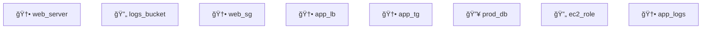

```mermaid
graph TD
    aws_instance_web_server["🆕 web_server"]
    aws_s3_bucket_logs_bucket["🔄 logs_bucket"]
    aws_security_group_web_sg["🆕 web_sg"]
    aws_lb_app_lb["🆕 app_lb"]
    aws_lb_target_group_app_tg["🆕 app_tg"]
    aws_db_instance_prod_db["🔥 prod_db"]
    aws_iam_role_ec2_role["🔄 ec2_role"]
    aws_cloudwatch_log_group_app_logs["🆕 app_logs"]
```
